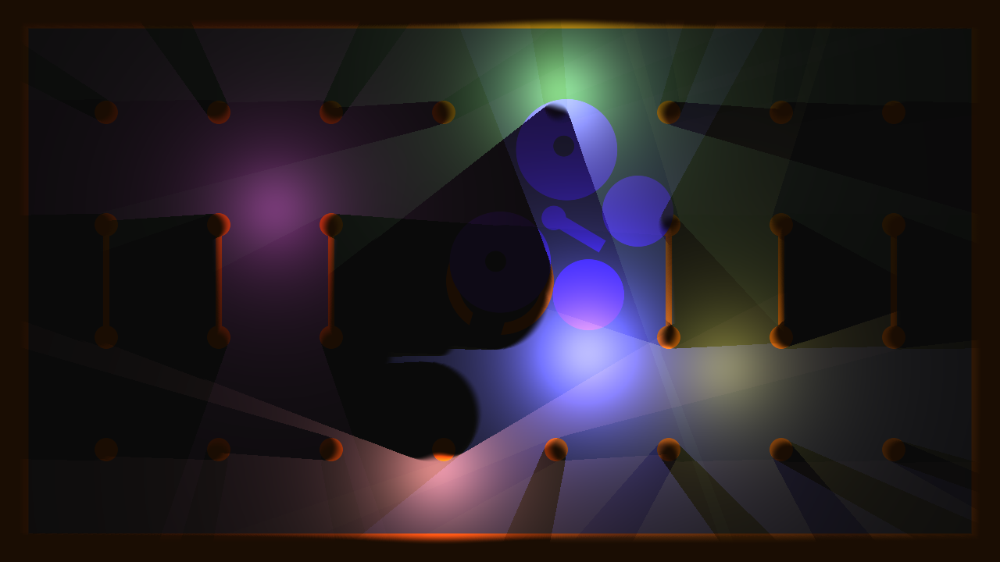

# 1D Radial Lightmap Test — 本地复刻版

一个完全离线的单文件 WebGL2 复刻，重现 Shadertoy 上的经典着色器作品
**[1D Radial Lightmap Test](https://www.shadertoy.com/view/XsK3RR)**（作者 [Flyguy](https://www.shadertoy.com/user/Flyguy)，2016），
并在此基础上加入了参数调节面板和一只可在场景中**前后穿梭飞行**的蝴蝶。



## 这是什么

原作的核心思想：为场景中每个光源渲染一张 **1D 径向距离场阴影图**——
Buffer A 的每一行对应一个光源，记录该光源周向 360° 的距离场步进结果；
Image pass 读取这张"光图"重建整个场景的光照与软阴影。
场景中的任何物体（包括飞过的蝴蝶）都会实时向所有光源投下径向阴影。

## 运行

无需构建、无任何依赖，**直接双击 `index.html`** 即可运行（需要支持 WebGL2 的浏览器）。

也可用任意静态服务器，例如：

```bash
node server.js        # 内附极简静态服务器，端口 8642
# 或 python3 -m http.server
```

## 操作

| 输入 | 作用 |
| --- | --- |
| 拖动鼠标 | 移动 1/2 号光源（镜像的一对） |
| `Space` | 暂停 / 继续 |
| `R` | 重置时间与光源位置 |
| `F` | 全屏 |
| `S` | 保存当前画面为 PNG |
| `P` / `H` | 收起参数面板 / 隐藏全部面板 |

## 参数面板

- **场景**：墙色、地色、环境光强度
- **光照**：光强增益、阴影柔度（半影宽度）、动画速度
- **光源 ×6**：每个光源独立的颜色与亮度倍率（0 = 关闭）
- **蝴蝶**：显示开关、颜色、大小、扑翼频率（恒定频率均匀扑翼）、
  飞行速度、飞行范围；蝴蝶按伪深度与场景分层合成——
  飞远时被柱子/圆环遮挡，飞近时从它们前方掠过，并始终向全部光源投射移动阴影

点击面板底部按钮可一键重置全部参数（默认值 = 原作行为）。

## 复刻要点

- 着色器源码与原作**逐字一致**；所有参数通过运行时定点替换注入 uniform 实现
- Shadertoy 的 buffer 纹理是 **RGBA32F 浮点格式**（从其引擎源码 `TEXFMT.C4F32` 查证），
  本地用 `EXT_color_buffer_float` + ping-pong FBO 等价复现，保证负坐标光源与高亮颜色不被截断
- 完整模拟 Shadertoy uniform 环境：`iResolution / iTime / iTimeDelta / iFrame / iFrameRate /
  iMouse / iDate / iChannelTime / iChannelResolution / iSampleRate`
- 蝴蝶以 SDF 注入两个 pass 的 `Scene()`（保证阴影一致），Image pass 中按深度独立合成产生前后遮挡

## 版权与致谢

着色器源码版权归原作者 **Flyguy** 所有，
遵循 Shadertoy 默认许可协议 [CC BY-NC-SA 3.0](https://creativecommons.org/licenses/by-nc-sa/3.0/)。
本仓库是学习性质的本地复刻与扩展，**请勿用于商业用途**。
